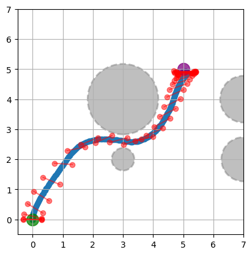

# diffusion_policy_quadrotor
This repository provides a demonstration of imitation learning using a diffusion policy. The implementation is adapted from the official Diffusion Policy [repository](https://github.com/real-stanford/diffusion_policy).

## Result
The control task is to drive the quadrotor from the initial position (0, 0) to the goal position (5, 5) without collision with the obstacles. The animation shows the denoising process of the diffusion policy predicting future trajectory followed by the quadrotor applying the actions. 

 

## Usage
The notebook `demo.ipynb` demonstrates a closed-loop simulation using the diffusion policy controller for quadrotor collision avoidance. You can run it in colab .

The training script is provided as `train.ipynb`.

## Dependencies
The program was developed and tested in the following environment.
- Python 3.10
- `torch==2.2.1`
- `jax==0.4.26`
- `jaxlib==0.4.26`
- `diffusers==0.27.2`
- `torchvision==0.14.1`
- `gdown` (to download pre-trained weights)
- `joblib` (format of training data)

## Diffusion policy
The policy takes 1) the latest N step of observation $o_t$ (position and velocity) and 2) the encoding of obstacle information $O_{BST}$ (7x7 grid with obstacle radius as values) as input and outputs N steps of actions $a_t$ (future position and future velocity).

*The quadrotor icon is from [flaticon](https://www.flaticon.com/free-icon/quadcopter_5447794).

### Deviation from the original implementation
- Add a linear layer before the Mish activation to the condition encoder of `ConditionalResidualBlock1D`. This is to prevent the activation from truncating large negative values from the normalized observation.

## Learning note
Refer to `learning_note.md`.

