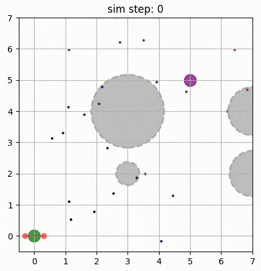

# diffusion_policy_quadrotor
This repository provides a demonstration of imitation learning using a diffusion policy on quadrotor control. The implementation is adapted from the official Diffusion Policy [repository](https://github.com/real-stanford/diffusion_policy) with an additional feature of using CBf-CLF controller to improve the safety of the generated trajectory.

## Result
The control task is to drive the quadrotor from the initial position (0, 0) to the goal position (5, 5) without collision with the obstacles. The animation shows the denoising process of the diffusion policy predicting future trajectory followed by the quadrotor applying the actions. 

 

## Usage
The notebook `demo.ipynb` demonstrates a closed-loop simulation using the diffusion policy controller for quadrotor collision avoidance. You can run it in colab .

The training script is provided as `train.ipynb`.

## Dependencies
The program was developed and tested in the following environment.
- Python 3.10
- `torch==2.2.1`
- `jax==0.4.26`
- `jaxlib==0.4.26`
- `diffusers==0.27.2`
- `torchvision==0.14.1`
- `gdown` (to download pre-trained weights)
- `joblib` (format of training data)

## Diffusion policy
The policy takes 1) the latest N step of observation $o_t$ (position and velocity) and 2) the encoding of obstacle information $O_{BST}$ (a flattened 7x7 grid with obstacle radius as values) as input. The outputs are N steps of actions $a_t$ (future position and future velocity).

*The quadrotor icon is from [flaticon](https://www.flaticon.com/free-icon/quadcopter_5447794).

### Deviation from the original implementation
- Add a linear layer before the Mish activation to the condition encoder of `ConditionalResidualBlock1D`. This is to prevent the activation from truncating large negative values from the normalized observation.
- A CLF-CBF-QP controller is implemented and used to modify the noisy actions during the denoising process of the policy. By default, this controller is disabled.
- A finetuned model for single-step inference is used by default.

## References
Papers
- [Diffusion Policy: Visuomotor Policy Learning via Action Diffusion](https://diffusion-policy.cs.columbia.edu/) [arXiv:2303.04137]
- [3D Diffusion Policy: Generalizable Visuomotor Policy Learning via Simple 3D Representations](https://3d-diffusion-policy.github.io/) [arXiv:2403.03954]
- [Fine-Tuning Image-Conditional Diffusion Models is Easier than You Think](https://gonzalomartingarcia.github.io/diffusion-e2e-ft/) [arXiv:2409.11355]

Videos and Lectures
- [DeepLearning.AI: How Diffusion Models Work](https://www.deeplearning.ai/short-courses/how-diffusion-models-work/)
- [[论文速览]Diffusion Policy: Visuomotor Policy Learning via Action Diff.[2303.04137]](https://www.bilibili.com/video/BV1Cu411Y7d7)
- [[論文導讀]Planning with Diffusion for Flexible Behavior Synthesis解說 (含程式碼)](https://youtu.be/ciCcvWutle4)
- [6.4210 Fall 2023 Lecture 18: Visuomotor Policies (via Behavior Cloning)](https://youtu.be/i-303tTtEig)

## Learning note
### Failure case: the diffusion policy controller failed to extrapolate from training data
Figure: A failure case of the controller.
- The left figure is a trajectory in the training data.
- The middle figure is the closed-loop simulation result of the controller starting from the SAME initial position as the training data.
- The right figure is the closed-loop simulation result of the controller starting from a DIFFERENT initial position, which resulted in a trajectory with collision.

Refer to [`learning_note.md`](learning_note.md) for other notes.

